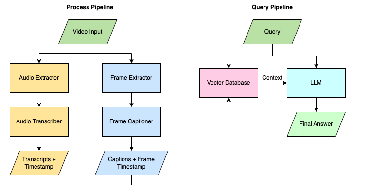

# Video Understanding Chatbot

This application is a video understanding chatbot system that allows users to ask questions about video content using text or images. The system processes video input to extract transcripts, captions, and frame-level information and answers user queries using an LLM (powered by LLaMA 3.1).

## System Overview

The backend architecture consists of two main pipelines:



### Process Pipeline

- **Video Input**: The raw video file fed into the system.
- **Audio Extractor**: Uses `moviepy` to extract the audio track from the video.
- **Audio Transcriber**: Transcribes the extracted audio into text along with timestamps using OpenAI’s `whisper` model.
- **Frame Extractor**: Uses `cv2` to extract key frames from the video at regular intervals.
- **Frame Captioner**: Generates visual captions for each frame using the `BLIP` model, with associated timestamps.
- **Transcripts + Timestamp**: Output of the audio analysis, used for answering text-based queries.
- **Captions + Frame Timestamp**: Output of the visual analysis, used for answering image-based queries.
- **Vector Database**: All captions and transcripts are embedded and stored in `Milvus Database` for fast similarity search.

### Query Pipeline

- **Query**: The user submits a text or image-based question through the interface.
- **Vector Database (Milvus)**: The query is first used to search the vector database for the most relevant transcripts or frame captions. The results include both content and associated timestamps.
- **LLM (LLaMA 3.1 via Ollama)**: The retrieved context (transcripts and/or captions) along with the original query are passed to the `LLaMA 3.1` model, hosted locally via `Ollama`, to generate a coherent and grounded response.
- **Final Answer**: The response is shown to the user in the Streamlit-based web interface.

## How to Run

Make sure you have Docker installed, then simply run:

```bash
docker compose up
```

Once the services are running, open your browser and go to:

```
http://localhost:8051
```

to explore the web interface built with Streamlit.

## License

MIT License. Free to use and modify.
